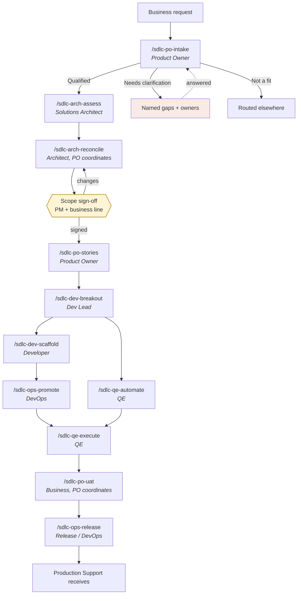

<!-- v0.3.0 · created 2026-08-05 · updated 2026-08-12 · owner TBD -->

# AI-Assisted SDLC Framework for Salesforce / nCino

This repository is the **framework rollout** for AI-assisted SDLC. It defines the
delivery spine, ownership model, prompts, skills, context, validation, and contribution
pattern teams will use to carry work from intake through production.

It is not an application. It is a source-controlled delivery playbook that AI agents can
read.

**New here?** → `sdlc-copilot/docs/start-here.md` — organized by role.
**Adding a skill?** → `sdlc-copilot/docs/add-a-skill.md`, then copy `sdlc-copilot/template/`.
**Skill registry?** → `sdlc-copilot/SKILLS.md` — every skill, owner, status, and handoff.
**Worked example?** → `sdlc-copilot/projects/JIRA-0000-loan-exception-example/` — synthetic early-chain output.

---

## The Delivery Spine



| # | Skill | Owner | Hands to |
|---|---|---|---|
| 01 | `sdlc-po-intake` | PO | `sdlc-arch-assess` |
| 02 | `sdlc-arch-assess` | SA | `sdlc-arch-reconcile` |
| 03 | `sdlc-arch-reconcile` | SA, PO coordinates, PM signs | `sdlc-po-stories` |
| 04 | `sdlc-po-stories` | PO | `sdlc-dev-breakout` |
| 05 | `sdlc-dev-breakout` | Dev Lead | `sdlc-dev-scaffold` + `sdlc-qe-automate` |
| 06 | `sdlc-dev-scaffold` | Developer | `sdlc-ops-promote` |
| 07 | `sdlc-qe-automate` | QE, concurrent with 06 | `sdlc-qe-execute` |
| 08 | `sdlc-ops-promote` | DevOps | `sdlc-qe-execute` |
| 09 | `sdlc-qe-execute` | QE | `sdlc-po-uat` |
| 10 | `sdlc-po-uat` | Business, PO coordinates | `sdlc-ops-release` |
| 11 | `sdlc-ops-release` | Release / DevOps | Production Support receives |

**Each output is the next step's input.** That contract is declared in every skill's
frontmatter (`input_from` / `output_to`), so a broken chain is visible in the files
rather than discovered in a meeting.

---

## Current State

This is the foundation release of the framework rollout.

- All 11 persona workflow stages have a matching prompt and base skill.
- Intake, architecture assessment, and story creation are active reference implementations.
- Reconciliation, development, QE, promotion, UAT, and release are foundation skills ready
  for their owning teams to refine against actual practice.
- Five `sf-skills-*` wrappers demonstrate how vendor-origin Salesforce skills connect to
  the local SDLC without entering the persona spine.
- The context library is deliberately skeletal. Skills stop or limit their output when a
  required policy, standard, owner, or guardrail has not been populated by a human.

This is enough to begin team review and iteration. It is not yet configured for live
organizational delivery.

## Human Accountability And Verification

AI can draft, analyze, organize, and recommend. It cannot own an outcome, accept risk,
make a business commitment, or approve a release. Every skill therefore declares:

- `accountable_role` — the human role that owns the outcome
- `verifier_role` — the human role that checks the work and evidence
- `human_gate` — the decision required before handoff
- `verification_evidence` — what must be available to support that decision

This matters because polished output can still be incomplete or wrong. Verification makes
the sources, assumptions, unresolved gaps, and evidence inspectable. Human-in-the-loop
means a person decides at a meaningful handoff, not that someone performs a ceremonial
review after every automated step. AI always records the gate as `Pending`; only the named
verifier may record `Accepted` or `Rejected` in the approved system of record.

## Appropriate Context And Model

The framework loads the smallest authoritative context package sufficient for the task:

| Layer | What loads | Why |
|---|---|---|
| Always on | `.github/copilot-instructions.md` | Short non-negotiable rules |
| On match | The selected `SKILL.md` | Method, controls, and output contract |
| On reference | Files named by `reads_context` | Only the relevant organizational facts |
| For the request | Named project artifacts | Current intake, design, stories, or evidence |

Too little context creates assumptions and missed controls. Too much can introduce stale or
conflicting information, disclose unnecessary data, and consume tokens without improving
quality. The goal is **relevant, current, authoritative, and sufficient** context.

Skills also declare one durable model tier:

| Tier | Typical use |
|---|---|
| `efficient` | Extraction, classification, formatting, routine summaries |
| `balanced` | Most workflow, implementation, planning, and review work |
| `deep-reasoning` | Competing designs, cross-system ambiguity, high-consequence tradeoffs |

Copilot Auto is the default. Prompt files intentionally omit exact model names because
model availability, pricing, and performance change. Pin a model only when representative
evaluation shows that it materially improves the result. See
`sdlc-copilot/context/model-routing.md`.

## Implementation Plan

1. **Enroll owners.** Replace CODEOWNERS placeholders, assign a person to every skill and
   context file, and confirm the eleven handoff contracts.
2. **Configure the framework.** Populate organization profile, guardrails, estimation,
   development, QE, security, nCino, and release standards from approved sources.
3. **Exercise and improve it.** Run one real request through the spine, retain human
   approvals in existing systems of record, revise the skills from evidence, and then
   expand the `sf-skills-*` set through reviewed upstream imports.

---

## Architecture

Three layers. The separation is the whole design.

```
┌──────────────────────────────────────────────────────────────────┐
│  PROMPT           .github/prompts/*.prompt.md                    │
│                   Thin launcher. Puts the command in the / menu. │
│                   Calls the skill. Auto model by default.        │
│                   -> Copilot-specific · DISPOSABLE               │
├──────────────────────────────────────────────────────────────────┤
│  SKILL            .github/skills/<name>/SKILL.md                 │
│                   The method: inputs, phases, output, what is    │
│                   prohibited, when to escalate.                  │
│                   -> Agent Skills open standard · PORTABLE       │
├──────────────────────────────────────────────────────────────────┤
│  CONTEXT          sdlc-copilot/context/*.md                    │
│                   Facts about THIS organization: guardrails,     │
│                   profile, estimation, dev, QE, release, access. │
│                   -> Governed truth · HUMAN OWNED                │
└──────────────────────────────────────────────────────────────────┘
```

Each layer changes at a different rate and has a different owner.

| Layer | Changes when | Owned by |
|---|---|---|
| Prompt | The tool changes | Framework owner |
| Skill | The method improves | The persona's team |
| Context | The organization changes | Named context owners |

Swap Copilot for something else and only the prompt layer gets rewritten. The method and
facts survive.

---

## Personas And Namespaces

| Prefix | Persona | Owns |
|---|---|---|
| `po` | Product Owner / BA | Intake, stories, UAT coordination |
| `arch` | Solutions Architect | Assessment, reconciliation, signed-scope readiness |
| `dev` | Dev Lead & Developers | Build breakout, scaffold, developer evidence |
| `qe` | Quality Engineering | Test automation and execution |
| `ops` | DevOps & Release | Promotion, release, support handoff |

Typing `/sdlc-po` filters the command menu to what Product Owners touch. The prefix is
ownership, not permission — anyone may run any skill; ownership means who maintains it.

`.github/skills/` must stay flat. Copilot scans immediate children for `SKILL.md`, so
nesting breaks discovery silently. Grouping lives in the name prefix.

---

## Repo Layout

```
repository-root/
├── .github/                         Copilot discovery and GitHub governance
│   ├── copilot-instructions.md      always-on framework rules
│   ├── CODEOWNERS                   persona and shared-surface review
│   ├── prompts/                     thin slash-command launchers
│   ├── skills/                      flat method library
│   └── workflows/validate.yml       validation on pull requests
├── sdlc-copilot/                    framework support and project workspace
│   ├── context/                     human-owned organizational facts
│   │   ├── model-routing.md         durable model tiers and routing rules
│   │   └── reference/               vendor guidance below local guardrails
│   ├── docs/                        start-here and contribution guide
│   ├── projects/                    intake/project folders and worked example
│   ├── scripts/validate-skills.sh   local and CI validation
│   ├── template/                    starter files for a new skill and prompt
│   ├── SKILLS.md                    registry and description collision check
│   ├── README.md                    repository documentation
│   └── README.html                  self-contained team walkthrough
├── README.md                         GitHub landing page and pointers
└── .gitignore
```

Before you commit:

```bash
bash sdlc-copilot/scripts/validate-skills.sh
```

The validator catches failures that otherwise appear as "the skill just does not show up."

---

## Salesforce-origin Skill Examples

This repo owns the SDLC process layer. It also includes a few `sf-skills-*` examples to
show how teams can incorporate official Salesforce skills from
`https://github.com/forcedotcom/sf-skills`.

Our skills answer:

- What should we build?
- Why is it in scope?
- What controls apply?
- What evidence is needed?
- Which human decision is required?

Salesforce-origin skills answer:

- How do I generate or review Apex?
- How do I generate Flow?
- How do I build LWC?
- How do I write SOQL?
- How do I work with Salesforce metadata?

Naming convention:

`sf-skills-<upstream-skill-name>`

Examples:

- `sf-skills-platform-apex-generate`
- `sf-skills-automation-flow-generate`
- `sf-skills-experience-lwc-generate`
- `sf-skills-platform-soql-query`
- `sf-skills-platform-metadata-deploy`

The five included entries are **local integration wrappers**, not copied Salesforce
implementations. Their upstream names were verified at commit `4268120`. Preserve the
upstream name after the prefix, import all required upstream resources before claiming a
vendor snapshot is installed, pin reviewed versions, record local changes in
`upstream.md`, and track decisions in `sdlc-copilot/context/reference/sf-skills.md`.

---

## What This Does Not Do

- **It does not approve anything.** No sign-off, no risk acceptance, no production go/no-go.
  Every artifact names the human who must decide.
- **It does not generate code by itself.** Developer skills route to reviewed
  `sf-skills-*` or other vendor-origin skills and record controls.
- **It does not invent organizational policy.** If `sdlc-copilot/context/` does not cover it, the
  skill must say so and stop.
- **It is not deterministic.** We reduce variance in inputs, structure, and handoffs; we
  do not claim model output is identical every time.

---

## Extending It

Each team maintains its prefix through normal pull requests and owner review. Add
`sdlc-dev-*`, `sdlc-qe-*`, or `sdlc-ops-*` when the method is reusable, multi-user, and
distinct from an existing skill.

> **You may extend your own namespace. You may not change the spine without agreement.**

Shared surfaces that need agreement:

- Handoff contracts between existing skills
- `.github/copilot-instructions.md`
- New persona prefixes
- Anything in `sdlc-copilot/context/`
- Vendoring or approving upstream Salesforce-origin skills

## Team Readiness Checklist

- [ ] Replace every `TBD` owner in `sdlc-copilot/SKILLS.md`, skill metadata, context, and
  `.github/CODEOWNERS`
- [ ] Populate and approve the required files under `sdlc-copilot/context/`
- [ ] Confirm accountable and verifier roles for every skill and assign the model-routing owner
- [ ] Decide which real project artifacts may be committed under
  `sdlc-copilot/projects/` and which remain links to systems of record
- [ ] Complete license and security review before importing upstream Salesforce content
- [ ] Enable branch protection and the validation workflow
- [ ] Run `bash sdlc-copilot/scripts/validate-skills.sh`
- [ ] Walk one request through all eleven handoffs and revise from team feedback
